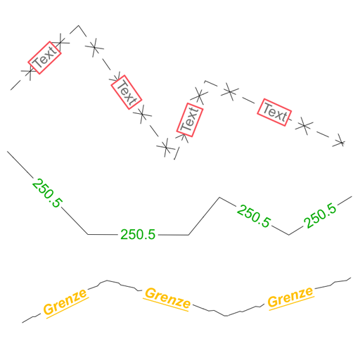
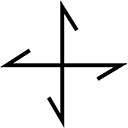
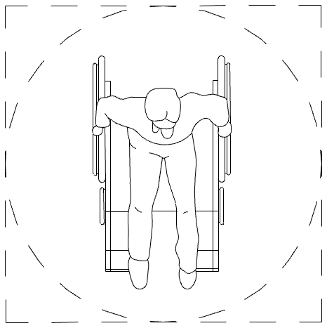
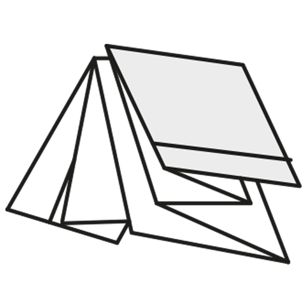

# [ArchiCAD-Objects](https://github.com/runxel/ArchiCAD-Objects)
ArchiCAD Objects made (or modified) by me.

---

### How to use?
Files are uploaded as `.gsm` (ArchiCAD library part / "object") and in the new HSF format introduced in Archicad 23.   
Thus they are easier to maintain and also you can see the source code directly. Converting can be done by using the [LP_XMLConverter](http://gdl.graphisoft.com/tips-and-tricks/how-to-use-the-lp_xmlconverter-tool/).  
The `.gsm` can be used directly and hasslefree. Please have a look at the compatibility down below.

#### Why are you not using the XML exchange format?
I did for a while, but it's plain useless now that we have the HSF format available thru the LP_XMLConverter. If you want to use it right away, there is `.gsm`; if you want to get a grasp of the code, the `.gdl` files are much more legible (And also you can go and edit it in an instant by cloning the repo unto your PC).

---

## Objects:
• [**Text auf Polylinie**](Objects/Text_auf_Polylinie)  
	· _Description_:   
	(DE) Zur Darstellung von Text auf einer Polylinie, auch in 3D. Nutzbar für Höhenlinien, Grenzen, u.ä.  
	(EN) Shows text on a polyline, even in 3D. Use cases are elevation lines, boundary curves, etc.  
	· _compatibility_: v20 build 6005  
	· _Language_: GER  
	· _Dependencies_: none (but is based on the polyline code by Esteban Ramos)  
	· _Version_: 1.0  
	

• [**Spannrichtung**](Objects/Spannrichtung)  
	· _Description_:  
	(DE) Zeigt die Spannrichtung von Deckenplatten im Tragwerksplan an. Sichtbarkeit richtet sich nach der Modelldarstellung.  
	(EN) Shows the direction of stress in ceiling slabs in the structural plan. Visibility depends on the MVO.  
	· _compatibility_: v19 build 5005  
	· _Language_: GER   
	· _Dependencies_: "Resize_A_B_ZZYZX" macro  
	· _Version_: 2.0  
	

• [**Rollstuhlgerecht**](Objects/Rollstuhlgerecht)  
	· _Description_:   
	(DE) Zur Überprüfung von Bewegungsflächen und des Wendekreises eines Rollstuhlfahrers.  
	(EN) For checking of turning circle of wheelchair users.  
	· _compatibility_: v22  
	· _Language_: GER  
	· _Dependencies_: none  
	· _Version_: 1.0  
	

• [**Faltmarker**](Objects/Faltmarker)  
    · _Description_:   
    (DE) Faltmarker zur Verwendung im Layout und der anschließenden (physischen) Ablage im A4-Endformat. DIN 824 konform.  
    (EN) Folding marker for the use in the layout. DIN 824 compliant.  
    · _compatibility_: v20  
    · _Language_: GER  
    · _Dependencies_: none  
    · _Version_: 1.2  
      
    DIN 824:  
    

---

### Compatibility
It is assumed that objects will be upwards compatible. Meaning: the version numbers above are the _lowest_ possible Archicad version where you can use the corresponding object.  
(If for any reason an object is not upwards compatible at some point in the future I will either make a new one, or will clearly state it here.)

---

If not stated otherwise the license is [Public Domain CC0 1.0](https://creativecommons.org/publicdomain/zero/1.0/).  
Please consider making pull requests if you find and correct bugs and/or introduce new features!

---

**Proudly made with [Sublime Text 3](https://www.sublimetext.com/) and the [GDL-Sublime](https://github.com/runxel/GDL-sublime) plugin.**

_Tautological boilerplate: All trademarks and copyrights on this page are the property of their respective owners._
