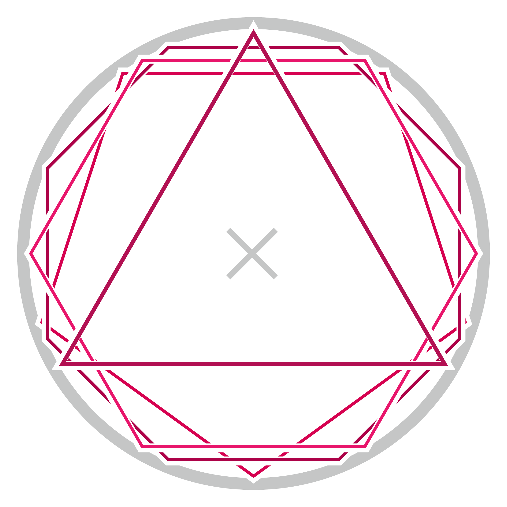
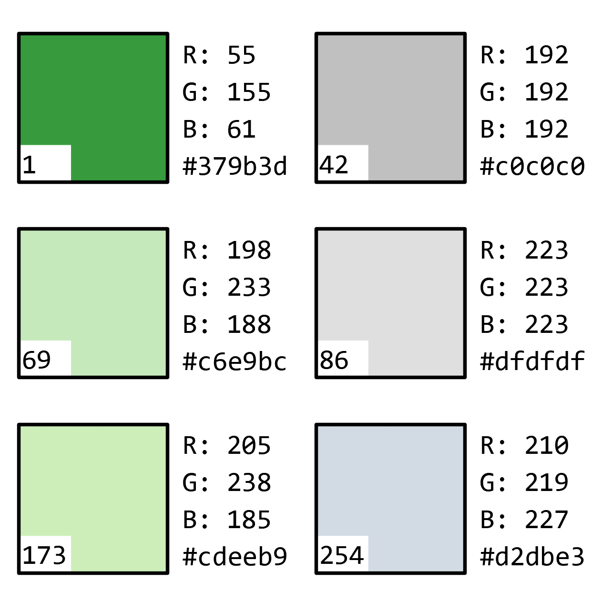
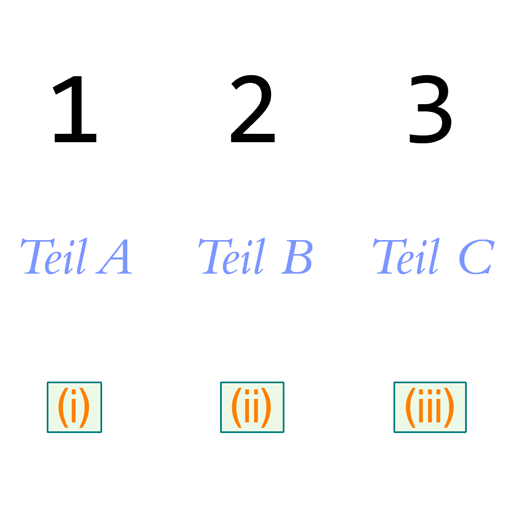

# [ArchiCAD-Objects](https://github.com/runxel/ArchiCAD-Objects)
ArchiCAD Objects made (or modified) by me.

---

### How to use?
Files are uploaded as `.gsm` (ArchiCAD library part / "object") and in the new HSF format introduced in Archicad 23.   
Thus they are easier to maintain and also you can see the source code directly. Converting can be done by using the [LP_XMLConverter](http://gdl.graphisoft.com/tips-and-tricks/how-to-use-the-lp_xmlconverter-tool/).  
The `.gsm` can be used directly and hasslefree. Please have a look at the compatibility down below.

#### Why are you not using the XML exchange format?
I did for a while, but it's plain useless now that we have the HSF format available thru the LP_XMLConverter. If you want to use it right away, there is `.gsm`; if you want to get a grasp of the code, the `.gdl` files are much more legible (And also you can go and edit it in an instant by cloning the repo unto your PC).

---

## Objects:

### [2D Complex Profile](Objects/2D_Complex_Profile)

(DE) Zur Anzeige von Komplexen Profilen aus dem Profil Manager im 2D.  
(EN) Displays a selected complex profile in 2D.  

_Anmerkung: Profilmodifikatoren können nicht verwendet werden. Es kann jedoch über `A` und `B` Stretchfaktoren eingegeben werden._  
_Note: Profile modifiers can not be used. However you may use `A` and `B` as stretch factors._

 

### [Text auf Polylinie](Objects/Text_auf_Polylinie)

 

(DE) Zur Darstellung von Text auf einer Polylinie, auch in 3D. Nutzbar für Höhenlinien, Grenzen, u.ä.  
(EN) Shows text on a polyline, even in 3D. Use cases are elevation lines, boundary curves, etc.  
Credit to Esteban Ramos for his polyline code.

 

### [Spannrichtung](Objects/Spannrichtung)

(DE) Zeigt die Spannrichtung von Deckenplatten im Tragwerksplan an. Sichtbarkeit richtet sich nach der Modelldarstellung. Darstellung gemäß DIN 1356-1 (12.4).  
(EN) Shows the direction of stress in ceiling slabs in the structural plan. Visibility depends on the MVO. Representation according to DIN 1356-1.  

 

### [Rollstuhlgerecht](Objects/Rollstuhlgerecht)

(DE) Zur Überprüfung von Bewegungsflächen und des Wendekreises eines Rollstuhlfahrers.  
(EN) For checking of turning circle of wheelchair users.  

 

### [Faltmarker](Objects/Faltmarker)

(DE) Faltmarker zur Verwendung im Layout und der anschließenden (physischen) Ablage im A4-Endformat. DIN 824 konform.  
(EN) Folding marker for the use in the layout. DIN 824 compliant.  

 

DIN 824:  

 

### [Isokorb (Attika)](Objects/Isokorb%20(Attika))

(DE) Isokorb zur 2D Detaillierung von Attiken im Schnitt.  
(EN) Isokorb for 2D detailing of parapet wall.  

 

### [Polygon](Objects/Polygon)

(DE) Regelmäßiges Polygon.  
(EN) A regular polygon inscribed in a circle.  

 

### [Profilierte Setzstufe LX23](Objects/Profilierte%20Setzstufe%20LX23)

(DE) Modifikation der 'Profilierten Setzstufe 23' von Graphisoft. Man kann nun zum einen das Setzstufenprofil auf die Höhe der Setzstufe strecken, sodass man bei Änderungen nicht unbedingt stets auch das Profil anpassen muss. Zum anderen ist es nun möglich Löcher in Lauflinienrichtung in die Setzstufe zu schneiden. Das Objekt bietet dabei viele Anpassungsmöglichkeiten.  
(EN) Modifiction of the 'Profiled Riser 23', provided by Graphisoft. You are now able to stretch the profile to fit the riser height. Also it is possible to cut holes orthogonally with many settings to customize.  

 

### [Stiftfarben](Objects/Stiftfarben)

(DE) Erweiterung des mitgelieferten 'Stiftfarben' Objekts. Dabei wurden die Standardeinstellungen etwas geändert, Schreibfehler ausgebessert und unsinnige Eingaben ausgeschlossen.  
(EN) An extension to the default supplied 'pen color test' object (the one you ought to print and check your pen colors).  

 

### [Nummerierung](Objects/Nummerierung)

(DE) Zur schnellen, linearen Nummerierung im 2D. Unterstützt numerisch (1, 2, 3, …), römisch (I, II, III, …) und Buchstaben (a, b, c, …).  
(EN) Let's you quickly enumerate linearly in the floorplan.  

 

---

### Compatibility
It is assumed that objects will be upwards compatible. Meaning: the version numbers above are the _lowest_ possible Archicad version where you can use the corresponding object.  
(If for any reason an object is not upwards compatible at some point in the future I will either make a new one, or will clearly state it here.)

---

If not stated otherwise the license is [Public Domain CC0 1.0](https://creativecommons.org/publicdomain/zero/1.0/).  
Please consider making pull requests if you find and correct bugs and/or introduce new features!

---

**Proudly made with [Sublime Text 3](https://www.sublimetext.com/) and the [GDL-Sublime](https://github.com/runxel/GDL-sublime) plugin.**

_Tautological boilerplate: All trademarks and copyrights on this page are the property of their respective owners._
